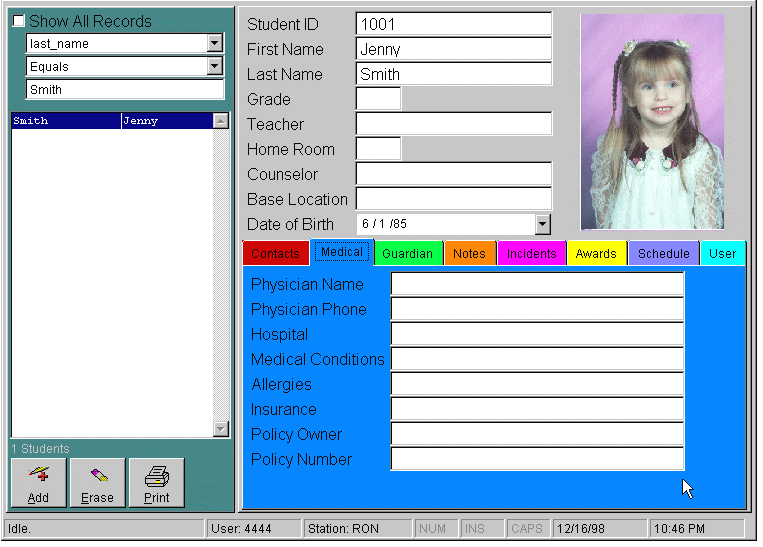

<a href="https://developer.microsoft.com"></a>
<a href="https://winworldpc.com/product/foxpro/26"></a>

# EZ-VIEW Student Information Management System (1998)

Welcome to the Redmer Software Company EZ-VIEW Student Information Management System. The RSC EZ-VIEW Student Image Viewer is a very simple to use yet powerful program for maintaining student information and quickly accessing student photographs stored on your computer. Using EZ-VIEW you can quickly retrieve information such as homeroom, home address, guardian information, emergency contacts, medical conditions, awards, disciplinary actions, and schedule of classes. You can easily add, change, and remove information from the system and share the information across a network so that it is accessible by teachers, librarians, counselors, administrators etc. There are several features that are unique to EZ-VIEW that make it one of the most powerful and popular Student Image Viewer programs available.

- EZ-VIEW is able to use photographs stored in more than 60 different file formats including all of the popular standard formats such Windows Bitmap (known as BMPs), Photoshop(r), Targa(r), Tiff(r), PhotoCD(r), and many others.
- EZ-VIEW is multi-user. Unlike other student image viewers, EZ-VIEW allows you store your student images anywhere on your computer or on your network and access them from any number of computers simultaneously. This feature simply allows you to install EZ-VIEW virtually anywhere for anyone who needs access to the information.
- EZ-VIEW uses industry-standard database technology that allows you to easily transfer information to and from other systems. Unlike other proprietary systems that lock your information in their hidden files, EZ-VIEW allow you to store your information anywhere on the network in the industry standard xBASE format. You can directly access these files in programs other than EZ-VIEW such as Microsoft Access(r), Microsoft FoxPro(r), Microsoft Word(r), Microsoft Excel(r), and Inprise dBASE(r) as well as any other program that supports the xBASE standard.
- EZ-VIEW includes a powerful report writer with built-in templates for student listings, detail reports, id cards, and awards. You can easily print reports using the included templates or you can modify the templates to meet your specific needs. You can also create new reports from scratch using the powerful report layout tool. EZ-VIEW is the only program of its kind to make use of Wizards that guide you through creating new reports step by step.
- EZ-VIEW is supported like no other student image viewer software, with technical notes, updates, and documentation freely available on GitHub. EZ-VIEWis the only application of its kind available absolutely free with complete source code on the Internet. This means that your local computer support team or network administrator has unlimited flexibility in installing the program and customizing it to meet your precise needs. Additionally, the application is ideal for teaching students programming and imaging techniques at the high school level.

## Table of Contents

- [Introduction](#introduction)
- [Features](#features)
- [Installation](#installation)
- [Usage](#usage)
- [Contributing](#contributing)
- [License](#license)
- [Contact](#contact)

## Introduction

EZVIEW is a robust student information management system developed by Redmer Software Company. It aims to streamline the process of managing student data, including enrollment, attendance, grades, and more. The system is designed to be user-friendly and highly customizable to meet the needs of educational institutions.

## Features

- **User Authentication**: Secure login and logout functionality.
- **Student Management**: Add, update, and delete student records.
- **Attendance Tracking**: Monitor and record student attendance.
- **Grade Management**: Manage and update student grades.
- **Reporting**: Generate comprehensive reports on student performance and attendance.
- **Customizable**: Easily customizable to fit the specific needs of your institution.



## Installation

To install EZVIEW, follow these steps:

1. Clone the repository:
    ```sh
    git clone https://github.com/yourusername/museum-redmer-software-ezview.git
    ```
2. Navigate to the project directory:
    ```sh
    cd museum-redmer-software-ezview
    ```
3. Install the necessary dependencies:
    ```sh
    npm install
    ```
4. Build the project:
    ```sh
    npm run build
    ```

## Usage

To start using EZVIEW, follow these steps:

1. Run the application:
    ```sh
    npm start
    ```
2. Open your web browser and navigate to `http://localhost:3000`.
3. Log in using your credentials.
4. Start managing student information!

## Contributing

We welcome contributions to improve EZVIEW. To contribute, please follow these steps:

1. Fork the repository.
2. Create a new branch:
    ```sh
    git checkout -b feature/your-feature-name
    ```
3. Make your changes and commit them:
    ```sh
    git commit -m "Add your commit message"
    ```
4. Push to the branch:
    ```sh
    git push origin feature/your-feature-name
    ```
5. Open a pull request.


## Contact
<a href="mailto:Ronald.Redmer@gmail.com"></a>
<a href="https://signal.link/call/#key=kmxm-qmqs-zcxx-znxm-tbpm-fgpf-xxzt-gsdh"></a>
<a href="https://t.me/RonaldRedmer"></a>
<a href="https://wa.me/12484972761"></a>

### Follow
<a href="https://bsky.app/profile/rredmer.bsky.social"></a>
<a href="https://devrant.com/users/rredmer"></a>
<a href="https://discordapp.com/users/RedZone"></a>
<a href="https://matrix.to/#/@ronaldredmer:matrix.org"></a>
<a href="https://www.kaggle.com/ronredmer"></a>
<a href="https://www.linkedin.com/in/rredmer/"></a>
<a href="https://mastodon.social/@RonaldRedmer"></a>
<a href="https://www.quora.com/profile/Ron-Redmer"></a>
<a href="https://www.reddit.com/user/RonaldRedmer/"></a>
<a href="https://stackoverflow.com/users/29130217/ron-redmer"></a>
<a href="https://www.tumblr.com/blog/ronaldredmer"></a>
<a href="https://www.twitch.tv/ronaldredmer"></a>
<a href="https://www.youtube.com/@RonaldRedmer"></a>

<a href="https://github.com/rredmer"></a>
<a href="https://dev.to/rredmer"></a>
<a href="https://medium.com/@ronald.redmer"></a>
<a href="https://x.com/ron_redmer"></a>

### Sponsor
<a href="https://github.com/sponsors/rredmer"></a>
<a href="https://buymeacoffee.com/rredmer"></a>
<a href="https://patreon.com/TechnologyPlayground"></a>
<a href="https://paypal.me/RonaldRedmer"></a>
<a href="https://donate.stripe.com/9AQg0G6on55a1pK288"></a>

### Web
<a href="https://ronaldredmer.com"></a>
<a href="https://a1si.com"></a>
<a href="https://techproductsgroup.com"></a>

## License
This project is licensed under the MIT License. See the [LICENSE](LICENSE) file for more details.
